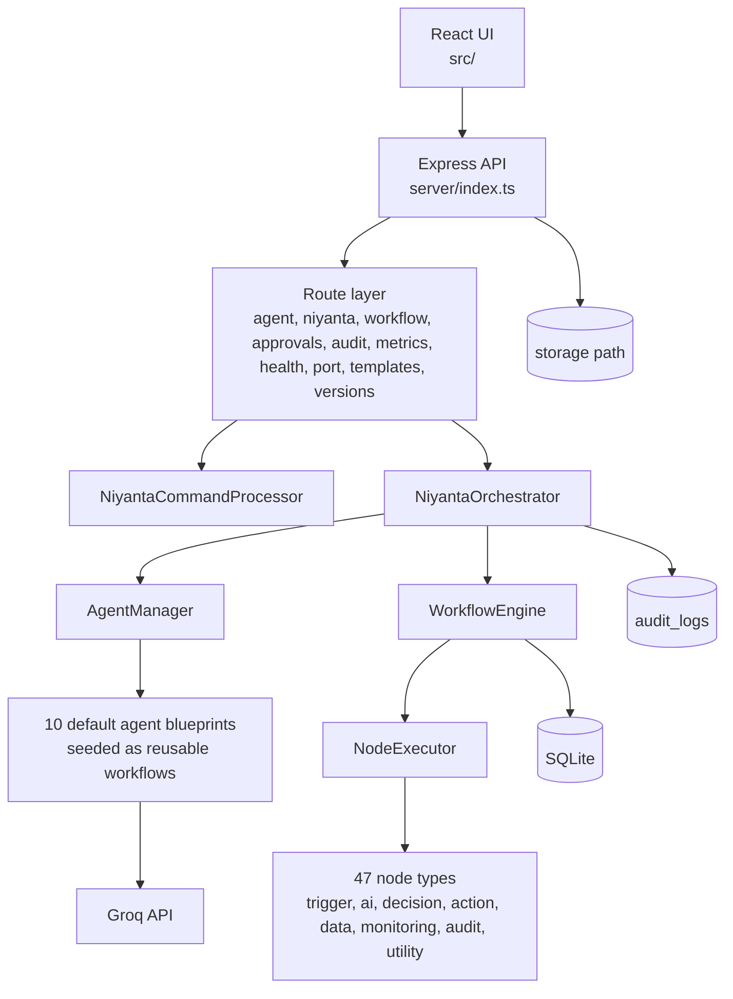

# Niyanta AI

Niyanta AI is an enterprise workflow orchestration platform built with React, Express, TypeScript, SQLite, and Groq-backed agents. It combines a node-based workflow engine, a central orchestrator, reusable agent workflows, local persistence, and human approval gates.

## What This Repository Contains

- React frontend in `src/` for workflow design, chat, approvals, audit views, and operational monitoring.
- Express backend in `server/` for orchestration, workflow execution, agent routing, APIs, and persistence.
- Local SQLite database with auto-initialized schema for workflows, runs, approvals, audit logs, agent messages, and ports.
- Groq model integration for agent reasoning and AI workflow nodes.
- Two persistence modes for the frontend: server-backed local persistence and browser-only demo persistence.

## Snapshot

| Area | Current implementation |
| --- | --- |
| Default agent blueprints | 10 |
| Registered workflow node definitions | 47 |
| API route groups | 10 |
| Main backend entry point | `server/index.ts` |
| Frontend dev server | `react-scripts start` on port 3000 |
| Backend dev server | Express on port 3001 by default |
| Local persistence | SQLite + filesystem storage |
| External dependency | Groq API for model inference |

## Architecture



### Core runtime flow

1. The frontend sends commands, workflow operations, or approvals to `/api/*` routes.
2. The backend validates input, applies rate limits to agent-heavy endpoints, and initializes DB/storage on boot.
3. `NiyantaCommandProcessor` parses natural-language commands and decides whether the request should go to an agent directly or into a workflow.
4. `NiyantaOrchestrator` selects agents, records audit events, maintains orchestration metrics, and merges workflow context.
5. `WorkflowEngine` creates workflow runs, walks the execution graph, persists run state, and records node-level execution logs.
6. `executeNode` dispatches each node type to trigger, AI, decision, action, data, monitoring, or utility behavior.
7. `AuditLogger` writes decision and execution metadata to `audit_logs` for traceability.

### Main components

| Component | Responsibility |
| --- | --- |
| `server/index.ts` | Bootstraps Express, storage path, DB, orchestrator, middleware, and route modules |
| `server/core/NiyantaCommandProcessor.ts` | Converts user commands into structured execution inputs |
| `server/core/NiyantaOrchestrator.ts` | Central coordinator for agent routing, planning, metrics, and audit logging |
| `server/core/WorkflowEngine.ts` | Creates runs, executes graphs, manages workflow state transitions |
| `server/core/AgentManager.ts` | Loads agents, links agent workflows, resolves canvas execution plans |
| `server/core/NodeRegistry.ts` | Registers 47 workflow node definitions and schemas |
| `server/nodes/nodeExecutor.ts` | Runtime dispatcher for concrete node execution |
| `server/db/database.ts` | Opens SQLite, initializes schema, applies lightweight migrations, seeds default content |
| `server/utils/groqClient.ts` | Groq model client and JSON-safe response parsing |

### Architecture notes

- The active backend entry point is `server/index.ts`. The root-level `server.ts` file is an older prototype and is not used by `npm run dev`.
- Default agents are seeded from `server/config/agentBlueprints.ts`, and each blueprint gets a backing workflow definition in SQLite.
- The orchestrator tracks approval waits, failures, and decision plans in audit logs rather than relying on transient in-memory state alone.
- Workflow runs persist to `workflow_runs`, while detailed node execution snapshots persist to `workflow_logs`.

## Built-in Agents

The default seeded agents are:

| Agent ID | Name | Primary role |
| --- | --- | --- |
| `meeting` | Meeting Intelligence | Transcript summarization, actions, decisions, risks |
| `invoice` | Invoice Processor | Invoice validation, anomaly checks, routing decisions |
| `document` | Document Intelligence | Document classification and field extraction |
| `finance_ops` | Finance Operations | Budget and expense analysis |
| `hr_ops` | HR Operations | Onboarding, leave, and policy workflows |
| `it_ops` | IT Operations | Access requests, incidents, and asset workflows |
| `compliance` | Compliance | Regulatory and policy evaluation |
| `security` | Security Monitor | Incident classification and response planning |
| `procurement` | Procurement | Purchase approvals and vendor policy checks |
| `workflow` | Workflow Intelligence | Workflow analysis, routing, and optimization |

## Setup

### Prerequisites

- Node.js 18+
- npm 9+
- A Groq API key

### 1. Install dependencies

```bash
npm install
```

### 2. Create your environment file

```bash
cp .env.example .env
```

Recommended baseline `.env`:

```env
GROQ_API_KEY=your_groq_api_key_here
PORT=3001
NODE_ENV=development
DB_PATH=./niyanta.db
STORAGE_PATH=./storage
REACT_APP_STORAGE_MODE=server
RATE_LIMIT_WINDOW_MS=60000
RATE_LIMIT_MAX=60
GROQ_MODEL=llama-3.3-70b-versatile
GROQ_REASONING_MODEL=llama-3.3-70b-versatile
GROQ_FAST_MODEL=llama-3.1-8b-instant
```

### 3. Understand the environment variables

| Variable | Required | Default | Purpose |
| --- | --- | --- | --- |
| `GROQ_API_KEY` | Yes | none | Enables Groq-backed agent and AI-node execution |
| `PORT` | No | `3001` | Backend HTTP port |
| `NODE_ENV` | No | `development` | Express runtime mode |
| `DB_PATH` | No | `./niyanta.db` | SQLite database path |
| `STORAGE_PATH` | No | `./storage` | Local file storage directory |
| `REACT_APP_STORAGE_MODE` | No | `server` | `server` for local backend persistence, `browser` for browser-only demo state |
| `RATE_LIMIT_WINDOW_MS` | No | `60000` | Agent endpoint rate-limit window |
| `RATE_LIMIT_MAX` | No | `60` | Max requests per window for rate-limited routes |
| `GROQ_MODEL` | No | `llama-3.3-70b-versatile` | Default model for standard tasks |
| `GROQ_REASONING_MODEL` | No | `llama-3.3-70b-versatile` | Reasoning-heavy model selection |
| `GROQ_FAST_MODEL` | No | `llama-3.1-8b-instant` | Lower-latency model selection |

### 4. Run the application

```bash
npm run dev
```

This starts:

- Frontend: `http://localhost:3000`
- Backend: `http://localhost:3001`
- Database: auto-created at `DB_PATH`
- File storage: auto-created at `STORAGE_PATH`

### 5. Verify the installation

Health check:

```bash
curl http://localhost:3001/api/health
```

End-to-end smoke test:

```bash
node test-workflow-execution.js
```

That script checks health, agent listing, workflow CRUD, workflow execution, run history, workflow metrics, and orchestrator chat.

### 6. Build for production

```bash
npm run build
npm run start:prod
```

Production mode serves the React build from `build/` through the Express server.

## Storage Modes

Niyanta supports two frontend persistence modes:

- `server`: recommended for local installs. State persists through the backend, SQLite, and local filesystem.
- `browser`: useful for lightweight demos. UI state is kept client-side for a browser-only experience.

If you change any `REACT_APP_*` value, restart the frontend dev server.

## API Surface

The backend mounts these route groups under `/api`:

| Route group | Purpose |
| --- | --- |
| `/api/agent` | Run agents, send inter-agent messages, manage ports |
| `/api/niyanta` | Chat, command execution, file extraction, insights |
| `/api/workflow` | Workflow CRUD, publish/unpublish, execute, dry-run, metrics, runs |
| `/api/approvals` | Human approval queue and approval actions |
| `/api/audit` | Audit log retrieval |
| `/api/metrics` | System-wide orchestration metrics |
| `/api/health` | Health and readiness data |
| `/api/port` | Access agents through generated agent ports |
| `/api/templates` | Workflow templates |
| `/api/versions` | Workflow version history |

## Persistence Model

The schema currently initializes these main tables:

- `agents`
- `nodes`
- `workflows`
- `workflow_runs`
- `workflow_logs`
- `audit_logs`
- `files`
- `pending_approvals`
- `workflow_versions`
- `agent_messages`
- `agent_ports`
- `agent_workflows`
- `agent_canvas_layouts`

## Project Layout

| Path | Purpose |
| --- | --- |
| `src/` | Frontend screens, hooks, services, workflow UI, chat UI |
| `server/routes/` | API route handlers |
| `server/core/` | Orchestration, workflow engine, registry, audit logging |
| `server/agents/` | Concrete agent prompt definitions and base agent class |
| `server/nodes/` | Node implementations and dispatch logic |
| `server/db/` | Database bootstrap, schema, migrations |
| `server/config/` | Default agent blueprint configuration |
| `server/templates/` | Workflow template seeds |
| `storage/` | Local artifacts and uploaded/generated files |
| `test-workflow-execution.js` | End-to-end integration smoke test |

## Operational Notes

- The backend auto-creates the storage directory if it does not exist.
- Health will report Groq as `DEGRADED` when `GROQ_API_KEY` is missing.
- Agent-heavy endpoints are rate-limited with `express-rate-limit`.
- Approval nodes persist pending decisions in `pending_approvals` and move workflow runs into `WAITING_APPROVAL`.
- `callGroqJSON()` strips markdown fences and falls back to a structured parse error payload if model output is not valid JSON.

## Related Document

For a quantified business-value model with explicit assumptions and back-of-envelope math, see [IMPACT_MODEL.md](IMPACT_MODEL.md).
